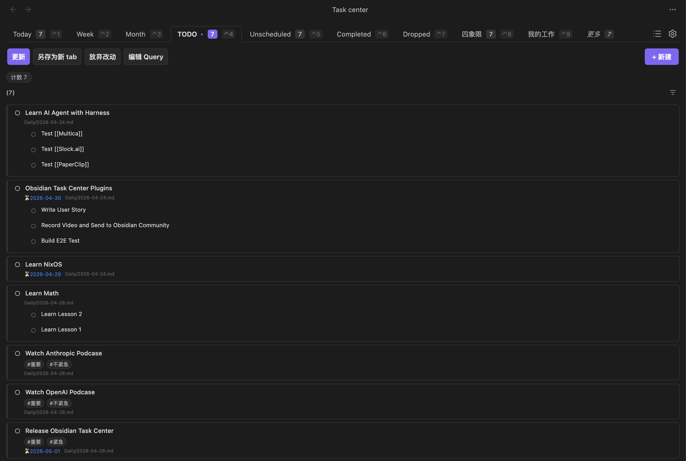
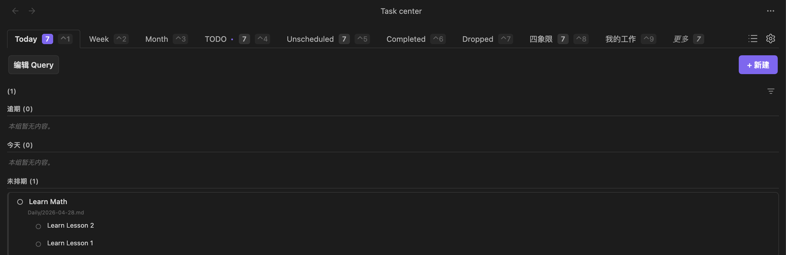
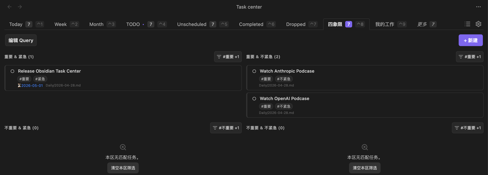
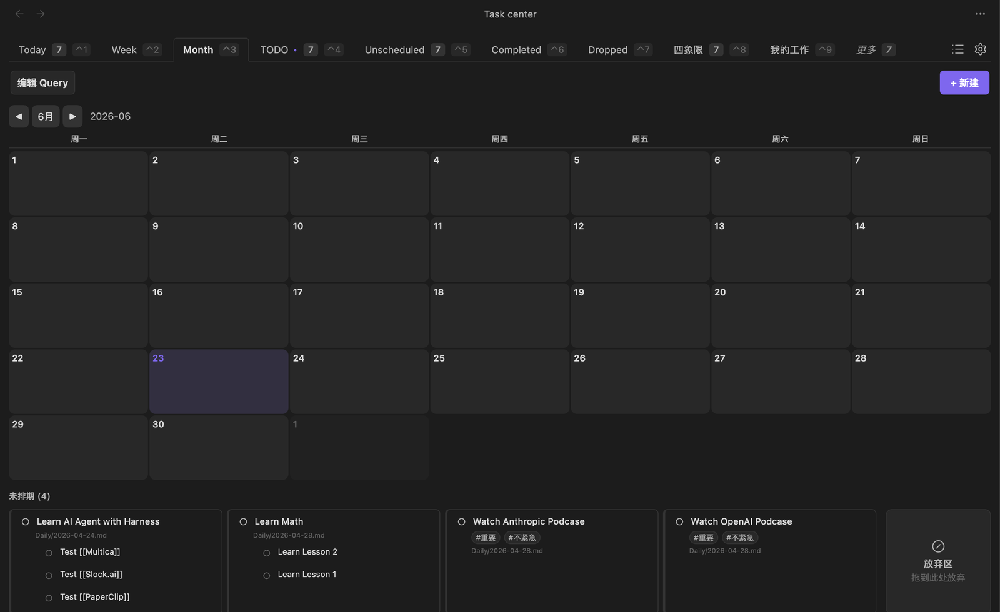
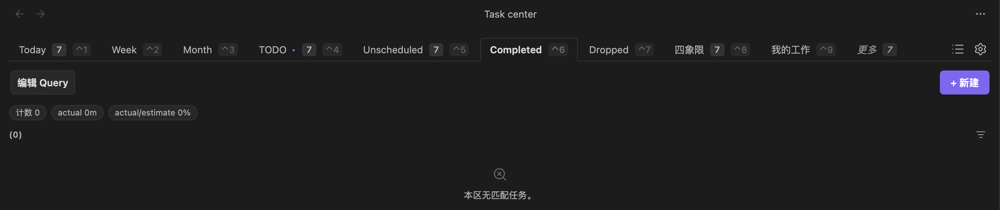

# Task Center Query DSL Reference

**English** · [中文](zh.md)

Every Tab in Task Center is a **Query DSL** (a single `QueryPreset` object). The same DSL drives all of: the graphical filters, the view layout, the top summary, and CLI queries. Click **Edit Query** on any Tab to see and edit this JSON directly.

> Markdown is the single source of truth. The DSL only decides *how to filter, sort, and arrange* — the task data itself always lives in the Markdown lines of your vault. Views, summaries, and filters are all derived from Markdown.
>
> This is a *how to write it* reference for users. For the field-by-field TypeScript types, see [`ARCHITECTURE.md` §1.3](../../ARCHITECTURE.md#13-querypreset).

---

## 1. The three sections of a preset

```jsonc
{
  "id": "preset-today",
  "name": "Today",
  "builtin": true,
  "hidden": false,

  "filters": { /* the base set of tasks for the whole view */ },
  "view":    { "layout": { /* the layout tree: how to arrange */ } },
  "summary": [ /* top-of-view metrics */ ]
}
```

| Section | Role |
| --- | --- |
| `filters` | The **base set** of tasks this view can see. Each area's `when` only **narrows further** on top of it — it never widens. |
| `view.layout` | The **layout tree**: which components to show on the page and how they nest. |
| `summary` | Metrics (count / sum / ratio …) rendered at the top of the view. |

There is no "view type" enum and no `preset` discriminator field. What a view looks like is **decided entirely by the `view.layout` tree**.

---

## 2. filters: define the base set first

`filters` describes "which tasks this Tab sees by default".

```jsonc
"filters": {
  "search": "report",                          // text in title / body
  "tags": { "values": ["important"], "mode": "and" }, // tags, mode = and | or
  "status": ["todo"],                          // todo | done | dropped; omit = all
  "time": {
    "scheduled": "today",                      // ⏳ scheduled
    "deadline":  "next-7-days",                // 📅 deadline
    "completed": "week",                       // ✅ completed
    "dropped":   "month",                      // dropped at
    "created":   "2026-01-01..2026-06-30"      // created at
  }
}
```

### Date vocabulary (DateToken)

Every field under `time.*` accepts these tokens:

| Token | Meaning |
| --- | --- |
| `all` | no restriction |
| `today` / `tomorrow` | today / tomorrow |
| `week` / `next-week` | this week / next week |
| `month` | this month |
| `unscheduled` | **this field is empty** (e.g. "no scheduled date" = `scheduled: "unscheduled"`) |
| `overdue` | overdue (`deadline` only) |
| `next-7-days` | next 7 days (`deadline` only) |
| `2026-06-23` | a single day (`YYYY-MM-DD`) |
| `2026-06-01..2026-06-30` | a range (`from..to`) |

> `unscheduled` is not a date range — it means "this time field is empty".

---

## 3. view.layout: a SwiftUI-style layout tree

The layout tree is made of two kinds of node:

- **Container node (Stack)**: `row` (≈ HStack) or `col` (≈ VStack), nesting children via `children`, with optional `weight` for the flex ratio.
- **Leaf node (Area)**: the components that actually render content (`list` / `grid` / `week` / `month` / `drop`).

```jsonc
"layout": {
  "dir": "col",                 // col = vertical; row = horizontal
  "children": [
    { "type": "week" },         // leaf: week grid
    { "type": "list", "weight": 1 }  // leaf: list, takes 1 flex unit
  ]
}
```

The root can be a Stack, or **a single area directly** (no wrapper needed). For example, the TODO view's root is just one `list`:

```jsonc
"layout": { "type": "list" }
```

The old "view types" are now **area types**: a view is no longer limited to one type — you freely compose multiple areas. Week = `col[ week-grid, row[unscheduled, drop] ]`, Unscheduled = `col[ list ]`, and you can build your own `row[ work-list, personal-list ]` side by side.

---

## 4. The area types, one by one

### 4.1 list — task list

The workhorse: narrows the base set with `when` and renders a column of task cards. Parent/child tasks nest automatically.



```jsonc
{
  "type": "list",
  "when": { "tags": { "values": ["work"], "mode": "and" } }, // narrow on top of the base set
  "orderBy": ["deadline_risk", "created_desc"],
  "limit": 50,
  "emptyText": "No tasks"
}
```

| Field | Description |
| --- | --- |
| `when` | Filters that **narrow further** on top of `filters` (same `QueryFilters` shape). The graphical filter UI edits exactly this `when`. |
| `sections` | Split one list internally into titled groups by `when` (see below). |
| `orderBy` | Sorting, see [§5.4](#54-orderby-sorting) |
| `limit` | Maximum number of cards |
| `emptyText` | Text shown when the set is empty |

#### list + sections — multiple groups inside one list

The "Today" view is **one** list, split by `sections` into Overdue / Today / Unscheduled. It is the same component as TODO — the only difference is the DSL.



```jsonc
{
  "type": "list",
  "sections": [
    { "id": "overdue", "title": "Overdue",
      "when": { "time": { "deadline": "overdue" } },
      "orderBy": ["deadline_asc"], "limit": 3 },
    { "id": "today", "title": "Today",
      "when": { "time": { "scheduled": "today" } }, "limit": 3 },
    { "id": "unscheduled", "title": "Unscheduled",
      "when": { "time": { "scheduled": "unscheduled", "deadline": "unscheduled" } },
      "orderBy": ["created_desc"], "limit": 3 }
  ]
}
```

### 4.2 grid — card grid

Same fields and projection as `list`, but cards are arranged in a **responsive multi-column grid**. Two-dimensional classification (the four quadrants) is expressed by nesting several `grid`s — each with a `title` + `when` — inside `row`/`col`. There is **no dedicated matrix type**.



```jsonc
"layout": {
  "dir": "col",
  "children": [
    { "dir": "row", "children": [
      { "type": "grid", "title": "Important & Urgent",
        "when": { "tags": { "values": ["important", "urgent"], "mode": "and" } } },
      { "type": "grid", "title": "Important & Not urgent",
        "when": { "tags": { "values": ["important", "not-urgent"], "mode": "and" } } }
    ] },
    { "dir": "row", "children": [
      { "type": "grid", "title": "Not important & Urgent",
        "when": { "tags": { "values": ["not-important", "urgent"], "mode": "and" } } },
      { "type": "grid", "title": "Not important & Not urgent",
        "when": { "tags": { "values": ["not-important", "not-urgent"], "mode": "and" } } }
    ] }
  ]
}
```

### 4.3 week — week grid

A date grid laid out by week. Each day cell arranges its own content and implicitly carries `onDrop: { setScheduled: <that day> }` — dragging a card onto a day writes that day as its scheduled date.

![Week view = col[ week, unscheduled, drop ]](../assets/dsl/week.png)

```jsonc
{ "type": "week", "firstDayOfWeek": "monday" }   // monday | sunday
```

> See the full layout in [§6 Week](#week): below the week grid sits a row with an "Unscheduled" tray and a "Drop" zone.

### 4.4 month — month grid

A date grid laid out by month. Same usage as `week`, plus a density option.



```jsonc
{ "type": "month", "firstDayOfWeek": "monday", "density": "cards" } // compact | cards
```

### 4.5 drop — pure action drop zone

A drop zone with no query — it only accepts drag actions, so `onDrop` is required. The "Drop" zone is just a drop area.

> 🖼️ **Figure TODO** — the drop zone's receiving state on its own: the highlight/hover feedback when a task card is dragged over the "Drop" zone. Slot: between this note and the code block below.

```jsonc
{ "type": "drop", "title": "Drop", "onDrop": { "setStatus": "dropped" } }
```

### 4.6 unknown — the fallback

An unsupported area `type` (a typo, or a removed legacy type such as the old matrix) is **not an error**: it is normalized to `unknown`, the original JSON is preserved, and the view renders "unknown type + JSON" instead of failing to load the whole config.

> 🖼️ **Figure TODO** — craft an area with a misspelled `type` and capture the "unknown type + raw JSON" fallback rendering. Slot: below this paragraph.

---

## 5. Mechanisms

### 5.1 filters + when: layered narrowing

`filters` is the base set for the whole view; every list/grid area and every section's `when` **intersects** on top of it.

- There is no "global filter runtime state" that applies to the whole Tab.
- Each area's filter is **its own `when`**; the graphical filter UI edits that area's `when` directly — it is the same data as editing the DSL.

### 5.2 onDrop: write on drag

The write performed when a card is dropped onto an area. The three semantics are **mutually exclusive**:

| Field | Effect |
| --- | --- |
| `setStatus: "dropped"` | mark the task as dropped (the Drop zone) |
| `setScheduled: <DateToken>` | write a scheduled date (`week`/`month` day cells implicitly use that day) |
| `clearScheduled: true` | clear the ⏳ scheduled date on the dragged task's own line (the unscheduled tray) |

"Reschedule to tomorrow", "clear schedule", and "drop" are **general capabilities** of task cards and drop areas — not actions tied to any one view.

### 5.3 summary: top-of-view metrics

`summary` is an array of metrics rendered at the top of the view. The "Completed" view uses it to total actual time and the actual/estimate ratio:



> 🖼️ **Figure TODO** — the current screenshot is an empty state (the vault has no completed tasks yet, only the top summary chips). Create a few done tasks with `actual`/`estimate` and recapture to show real cards plus the sum/ratio values.

```jsonc
"summary": [
  { "type": "sum",   "field": "actual", "format": "duration" },
  { "type": "ratio", "numerator": "actual", "denominator": "estimate", "format": "percent" }
]
```

Supported `type`s: `count`, `sum` (over `field`), `ratio` (`numerator/denominator`), `top-n`, `group-by` (grouped by `by`). `format` can be `duration` / `percent`, etc.

### 5.4 orderBy sorting

`orderBy` takes an array of tokens applied in order as multi-level sort keys:

| Token | Meaning |
| --- | --- |
| `deadline_asc` / `deadline_desc` | by deadline, ascending / descending |
| `scheduled_asc` / `scheduled_desc` | by scheduled date |
| `created_desc` / `created_asc` | by created time |
| `completed_desc` | by completed time (newest first) |
| `deadline_risk` | by "deadline risk" (most urgent first) |
| `priority_desc` | by priority |
| `title_asc` | alphabetically by title |

### 5.5 limit / emptyText

`limit` caps the number of cards in a single list/section; `emptyText` customizes the message shown when the set is empty.

---

## 6. Built-in views: complete examples

These are the real factory DSLs of the built-in views — copy and tweak them as templates.

### TODO

A single ungrouped `list`:

```jsonc
{ "filters": { "status": ["todo"] },
  "view": { "layout": { "type": "list" } }, "summary": [] }
```

### Unscheduled

`col[ list ]`, where the list's `when` selects "no scheduled date":

```jsonc
{ "filters": { "status": ["todo"] },
  "view": { "layout": { "dir": "col", "children": [
    { "type": "list",
      "when": { "time": { "scheduled": "unscheduled" } },
      "orderBy": ["deadline_risk", "created_desc"] }
  ] } },
  "summary": [] }
```

### Week

`col[ week, row[ grid(unscheduled tray), drop ] ]`:

```jsonc
{ "filters": { "status": ["todo"] },
  "view": { "layout": { "dir": "col", "children": [
    { "type": "week" },
    { "dir": "row", "children": [
      { "type": "grid", "id": "unscheduled-tray", "title": "Unscheduled",
        "when": { "time": { "scheduled": "unscheduled" } },
        "onDrop": { "clearScheduled": true } },
      { "type": "drop", "title": "Drop",
        "onDrop": { "setStatus": "dropped" } }
    ] }
  ] } },
  "summary": [] }
```

### Completed

`list` + top summary:

```jsonc
{ "filters": { "status": ["done"] },
  "view": { "layout": { "type": "list", "orderBy": ["completed_desc"] } },
  "summary": [
    { "type": "sum",   "field": "actual", "format": "duration" },
    { "type": "ratio", "numerator": "actual", "denominator": "estimate", "format": "percent" }
  ] }
```

---

## 7. Graphical editing ↔ DSL ↔ CLI (one shared schema)

The graphical filter UI, editing the JSON directly via "Edit Query", and managing queries from the CLI all share the same DSL and validation: changing a filter in the UI edits some area's `when`, which is exactly equivalent to writing it by hand in this JSON.

> 🖼️ **Figure TODO** — show the graphical filter popover next to the corresponding `when` JSON snippet, with the one-to-one mapping called out. Slot: below this paragraph.

> **TODO (to write)**:
> - How the CLI reads/writes the same preset (mapping the `obsidian task-center:*` query commands to this DSL).
> - When graphical edits land in the tab draft, and how that relates to "Save / Save as".

---

## 8. Design principles in brief

1. **Markdown is the single source of truth**; the DSL is only a derived layer.
2. **One view = one layout tree**; no view-type enum, and the renderer never branches on names like today / completed.
3. **Filtering belongs to the area**: `filters` is the base set, `when` narrows on top, there is no global filter state.
4. **Actions are general capabilities**: reschedule / clear-schedule / drop are provided by cards and drop areas, not bound to a view.
5. **Unknown types don't error**: they normalize to an `unknown` fallback.

---

> Screenshots are from the desktop Task Center; tag names, group titles, and other text reflect each vault's real data.
